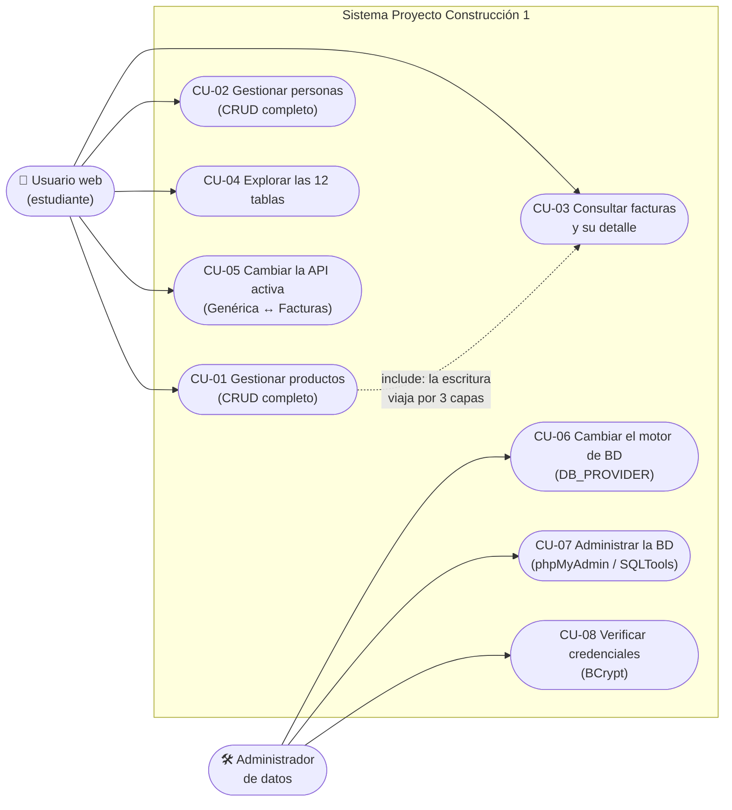
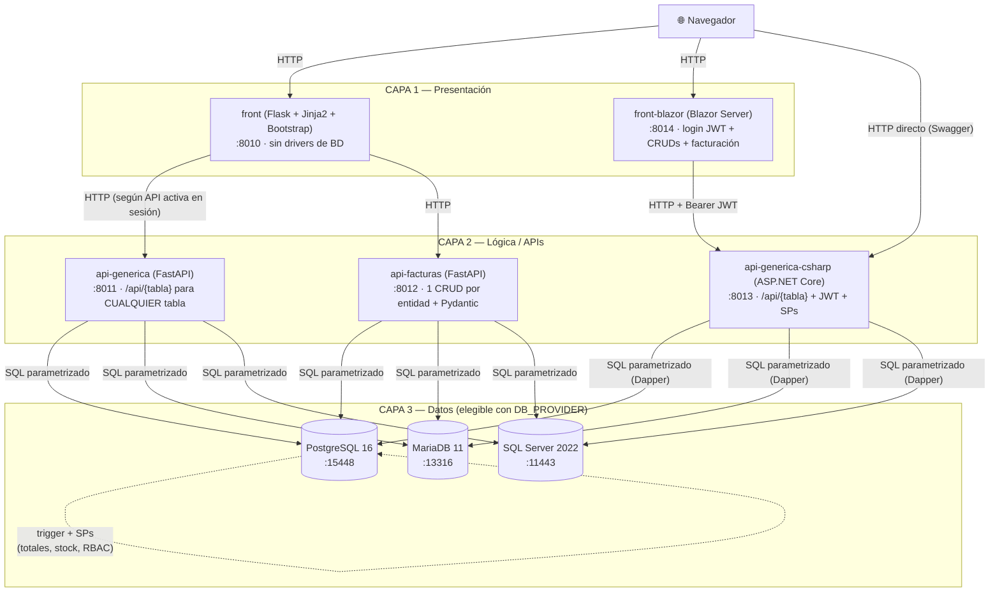
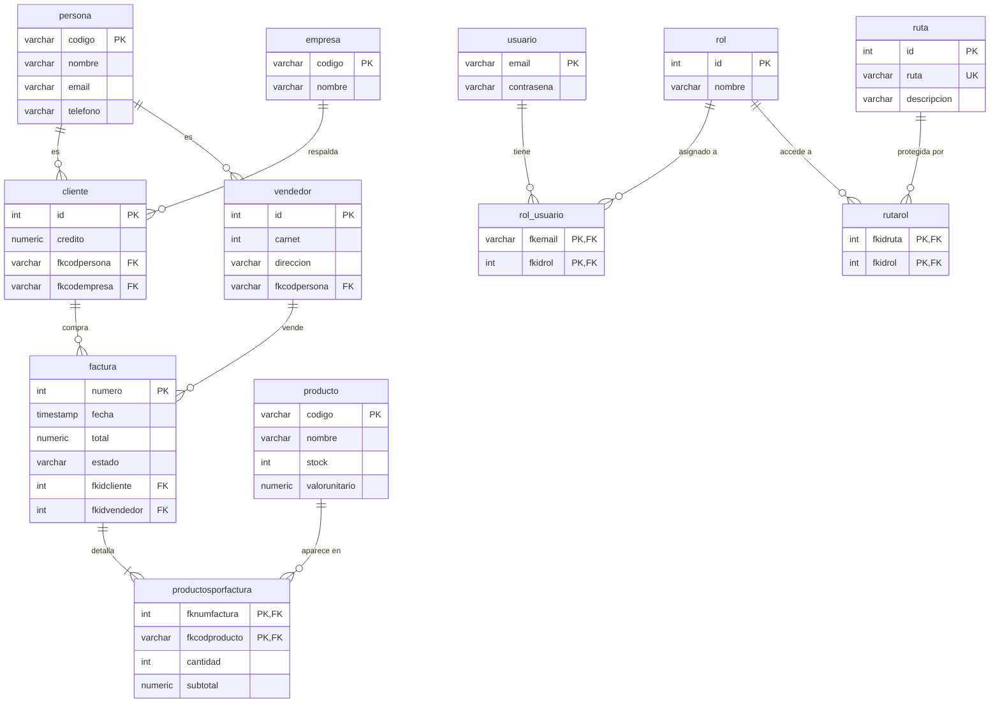
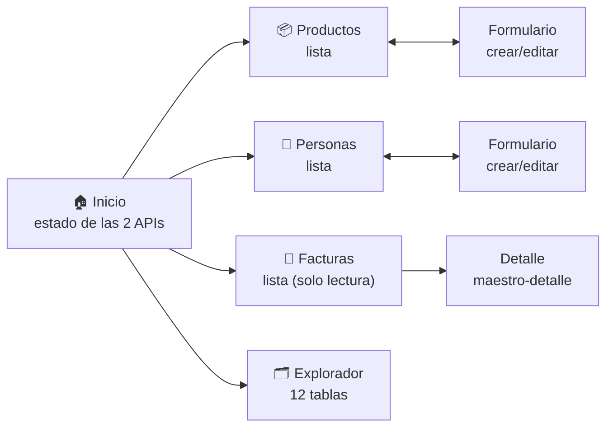
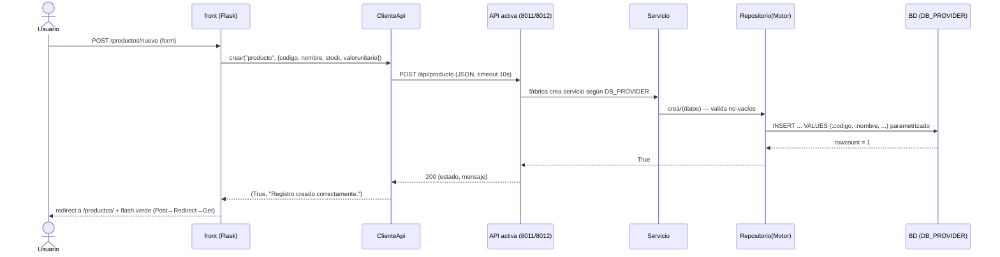
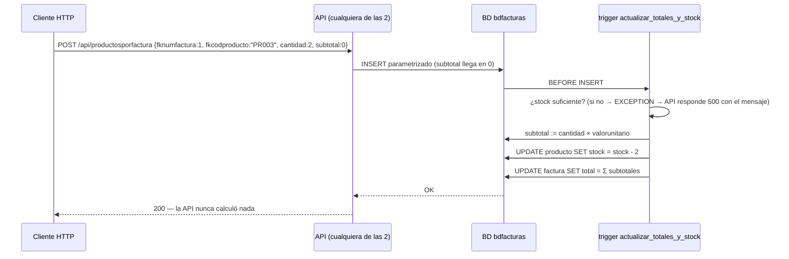
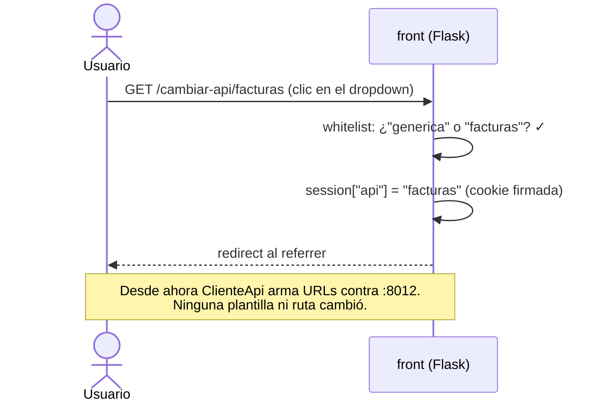
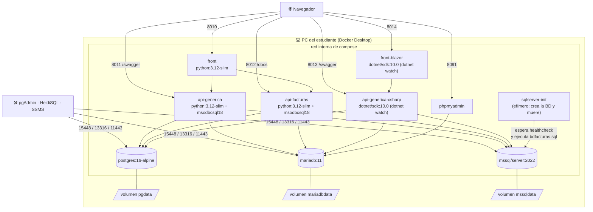

# Proyecto Construcción 1

Proyecto del curso **Construcción de Software 1** (USB Medellín). Entorno de aprendizaje **todo-en-uno con Docker**: una arquitectura real de **3 capas** — dos frontends (Flask y **Blazor**), dos APIs FastAPI, una API en **C# (ASP.NET Core)** y tres motores de base de datos — que se levanta completa con **un solo comando**. Solo se necesita Docker Desktop.

> **Para quién es esto:** estudiantes que ya cursaron *Paradigmas de Programación* y *Diseño de Software*. Aquí el foco es la **construcción**: partir de especificaciones (los **spec kits** de abajo, al estilo SDD/GitHub Spec Kit), implementar por capas con SOLID, verificar contra criterios de aceptación y desplegar con Docker. El análisis y el diseño ya vienen documentados en cada README — su trabajo es construir sobre ellos.

```
Navegador → FRONT Flask (8010)                                         (Python/Flask)
                ├── API GENÉRICA  (8011)  CRUD sobre cualquier tabla        (Python/FastAPI)
                └── API FACTURAS  (8012)  CRUD por entidad + Pydantic       (Python/FastAPI)
Navegador → FRONT Blazor (8014)  login JWT + CRUDs + facturación       (C#/Blazor Server)
                └── API GENÉRICA C# (8013)  mismo CRUD genérico + JWT + SPs (C#/ASP.NET Core)
                        └── PostgreSQL · MariaDB · SQL Server  (bdfacturas)
```

> 📖 **Documentación:** [Guía del estudiante](docs/GUIA_ESTUDIANTE.md) · [Arquitectura de 3 capas](docs/ARQUITECTURA_3_CAPAS.md) · [Principios SOLID y ACID aplicados](docs/PRINCIPIOS_SOLID_ACID.md) · [Conceptos clave](docs/CONCEPTOS.md) · [Conceptos de Docker](docs/CONCEPTOS_DOCKER.md) · [Cómo se construyó el entorno](docs/TUTORIAL_CONSTRUCCION.md) · [SDD y Spec Kit](docs/SDD_SPECKIT.md)
>
> 📐 **Spec kits** (especificación + plan + tareas para reconstruir cada pieza desde cero):
> [Proyecto e infraestructura](docs/spec_kit/2_spec.md) (con la [constitución](docs/spec_kit/1_constitution.md)) ·
> [API Genérica](api_generica/docs/spec_kit/2_spec.md) ·
> [API Facturas](api_facturas/docs/spec_kit/2_spec.md) ·
> [API Genérica C#](api_generica_csharp/docs/spec_kit/2_spec.md) ·
> [Front Flask](front_flask/docs/spec_kit/2_spec.md) ·
> [Front Blazor](front_blazor/docs/spec_kit/2_spec.md)

---

## Puesta en marcha (un solo comando)

En la terminal de VS Code:

> ⚠️ **ANTES de clonar — solo si usted ya corrió OTRO proyecto de estos
> cursos en este PC:** puede quedar un contenedor viejo encendido ocupando
> el puerto 8010 (pasa al reiniciar el PC: la API vieja revive sin su
> base de datos y "secuestra" el puerto — el contenedor huérfano). El
> síntoma: Swagger abre, pero todo responde 500 con *"No address
> associated with hostname"*, y usted cree que el error es de ESTE
> proyecto cuando en realidad está hablando con el viejo. Verifíquelo y
> apáguelo primero:
>
> ```powershell
> docker ps --filter "name=proyecto_"
> # ↑ VERIFICAR: ¿aparece algún proyecto del curso todavía encendido?
> docker ps --filter "name=proyecto_" -q | ForEach-Object { docker stop $_ }
> # ↑ LIMPIAR: apaga TODOS los contenedores del curso de una sola vez
> ```
>
> La limpieza no borra nada (los datos quedan en sus volúmenes) y
> funciona aunque ya no tenga la carpeta vieja. También sirve el botón
> Stop de Docker Desktop. Solo entonces continúe.

```bash
git clone https://github.com/ccastro2050/proyecto_construccion1.git
cd proyecto_construccion1
docker compose up -d --build
```

**Eso es todo.** La primera vez tarda unos minutos (descarga las imágenes). Al terminar:

| Qué | Dónde |
|---|---|
| **Frontend** (Flask + Bootstrap) | http://localhost:8010 |
| **API Genérica** — Swagger | http://localhost:8011/swagger |
| **API Facturas** — Swagger | http://localhost:8012/docs |
| **API Genérica C#** — Swagger (y ReDoc en `/redoc`) | http://localhost:8013/swagger |
| **Front Blazor** (Blazor Server, consume la API C#) | http://localhost:8014 |
| **phpMyAdmin** (admin web de MariaDB) | http://localhost:8091 |
| PostgreSQL 16 · MariaDB 11 · SQL Server 2022 | con la BD `bdfacturas` cargada |

Todo el código está **comentado en español** para quien está comenzando a programar.

---

## ¿Cambiaste el código? Así se actualiza Docker

El código de las apps está **montado como volumen** dentro de los contenedores (el front corre con `--debug` y las APIs con `--reload`), así que **la mayoría de los cambios no requieren ningún comando**:

| Qué cambiaste | Qué hay que hacer |
|---|---|
| Código Python o HTML (`front_flask/`, `api_generica/`, `api_facturas/`) | **Nada.** Guarda el archivo y recarga el navegador (F5) — el contenedor detecta el cambio solo. |
| Código C# (`api_generica_csharp/*.cs`, `front_blazor/*.razor|*.cs`) | **Nada.** `dotnet watch` recompila y reinicia solo (tarda unos segundos; míralo con `docker compose logs -f api-generica-csharp` o `front-blazor`). |
| `requirements.txt`, un `.csproj` o un `Dockerfile` (p. ej. una librería nueva) | `docker compose up -d --build` (reconstruye la imagen; puedes limitarlo: `docker compose up -d --build api-facturas`) |
| `docker-compose.yml` (puertos, variables, servicios) | `docker compose up -d` (recrea solo lo que cambió) |
| Scripts SQL de `db/` (tablas, triggers, datos iniciales) | `docker compose down -v` y luego `docker compose up -d` — ⚠️ **borra los datos** y recarga la BD desde cero |

Si un cambio no se refleja: `docker compose restart front` (o `api-generica` / `api-facturas`); en último caso, `docker compose up -d --build`.

---

## Estructura del proyecto

Qué es cada carpeta y cada archivo, y para qué sirve:

```
proyecto_construccion1/
├── docker-compose.yml      # TODA la infraestructura declarada aquí: 10 contenedores
│                           #   con un solo comando (2 fronts, 3 APIs, 3 motores,
│                           #   phpMyAdmin y el inicializador de SQL Server)
├── db/                     # Scripts que crean bdfacturas COMPLETA, uno por motor
│   ├── postgres/init.sql   #   (cada motor lo ejecuta solo la PRIMERA vez,
│   ├── mariadb/init.sql    #    cuando su volumen está vacío)
│   └── sqlserver/          #   init.sh + bdfacturas.sql (vía inicializador)
│
├── backupdb/               # Respaldos (dumps/.bak) de los 3 motores — su README
│                           #   explica cómo hacer cada backup y cómo restaurarlo
│
├── .devcontainer/          # Dev Container opcional de VS Code: abrir el proyecto
│                           #   DENTRO del contenedor del front, con SQLTools preconfigurado
│
├── front_flask/            # CAPA 1 — Frontend (puerto 8010)
│   ├── rutas/              #   Blueprints: productos, personas, facturas, explorador
│   ├── servicios/          #   cliente_api.py: consume cualquiera de las 2 APIs
│   └── templates/          #   HTML con Bootstrap 5 (herencia Jinja2)
│
├── api_generica/           # CAPA 2a — API CRUD genérica (puerto 8011)
│   ├── controllers/        #   /api/{tabla} sirve para CUALQUIER tabla
│   ├── servicios/          #   ServicioCrud + Fábrica + BCrypt
│   └── repositorios/       #   PostgreSQL | MariaDB | SQL Server
│
├── api_facturas/           # CAPA 2b — API por entidad (puerto 8012)
│   ├── controllers/        #   Un controller por tabla (12 entidades)
│   ├── models/             #   Modelos Pydantic (validación estricta)
│   ├── servicios/          #   Lógica de negocio por entidad
│   └── repositorios/       #   Un repositorio por entidad y por motor
│
├── api_generica_csharp/    # CAPA 2c — API genérica en C#/ASP.NET Core (puerto 8013)
│   ├── Controllers/        #   Entidades (/api/{tabla}), Autenticación JWT, Consultas,
│   │                       #   Procedimientos almacenados, Estructuras, Diagnóstico
│   ├── Servicios/          #   ServicioCrud + ProveedorConexion + BCrypt + políticas
│   └── Repositorios/       #   PostgreSQL | MariaDB | SQL Server (Dapper)
│
├── front_blazor/           # CAPA 1b — Front Blazor Server (puerto 8014), consume la API C#
│   ├── Components/Pages/   #   Login, CRUDs (12 entidades), Facturación completa
│   ├── Services/           #   ApiService + AuthService (JWT) + SpService (SPs)
│   └── Paso1..12*.md       #   Tutorial paso a paso con el que se construyó
│
└── docs/                   # La documentación del PROYECTO (la de cada app va adentro
    ├── spec_kit/           #   Spec kit del proyecto raíz (infraestructura como caja negra)
    ├── GUIA_ESTUDIANTE.md  #   Cómo trabajar día a día con el entorno
    ├── ARQUITECTURA_3_CAPAS.md      # El porqué del diseño front→API→BD
    ├── PRINCIPIOS_SOLID_ACID.md     # Los principios aplicados, con ejercicios
    ├── CONCEPTOS.md / CONCEPTOS_DOCKER.md  # Conceptos clave, y Docker a fondo
    ├── SDD_SPECKIT.md      #   La metodología: la spec manda sobre el código
    └── TUTORIAL_CONSTRUCCION.md     # Cómo se construyó este entorno, paso a paso
```

Cada componente (`api_generica/`, `api_facturas/`, `api_generica_csharp/`,
`front_flask/`, `front_blazor/`) lleva además su **propio spec kit
autocontenido** en `<componente>/docs/spec_kit/` (documentos 1 a 8) — con esa
carpeta sola se reconstruye la pieza desde cero — y las APIs cargan sus
scripts de bdfacturas en su `database/` o `script_bd/`, para poder entregarse
como proyectos independientes.

Las dos APIs Python siguen la misma arquitectura interna de sus repos originales:
[ApiGenericaFastApi_Crud](https://github.com/ccastro2050/ApiGenericaFastApi_Crud) y
[ApiFacturasFastApi_Crud](https://github.com/ccastro2050/ApiFacturasFastApi_Crud).

La **API Genérica C#** es la misma lógica de la API Genérica pero en otro lenguaje y framework
(ASP.NET Core / .NET 10 + Dapper): mismas rutas `/api/{tabla}`, misma fábrica de repositorios por
`DB_PROVIDER` y los mismos principios SOLID — ideal para **comparar cómo se construye lo mismo
en dos stacks distintos**. Además agrega autenticación **JWT**, ejecución de **consultas
parametrizadas** y **procedimientos almacenados** (guías en
[GUIA_USO_ENTIDADES.md](api_generica_csharp/GUIA_USO_ENTIDADES.md) y
[GUIA_USO_PROCEDIMIENTOS.md](api_generica_csharp/GUIA_USO_PROCEDIMIENTOS.md)).

---

## Análisis

### Casos de uso más representativos



| CU | Flujo principal (resumen) | Regla clave |
|---|---|---|
| CU-01/02 | Listar → formulario → POST → flash → volver a la lista (Post→Redirect→Get) | El front nunca toca la BD: todo pasa por una API |
| CU-03 | Lista de facturas → detalle maestro-detalle | Totales y subtotales los calcula el **trigger** de la BD |
| CU-05 | Dropdown del navbar guarda `session["api"]` | Las pantallas funcionan idéntico con las dos APIs |
| CU-06 | `$env:DB_PROVIDER=...` + `docker compose up -d` | Cero cambios de código: es el punto del curso |

### Historias de usuario

| # | Historia | Criterios de aceptación |
|---|---|---|
| HU-01 | **Como** estudiante **quiero** crear, editar y eliminar productos desde el navegador **para** ver un CRUD real atravesando 3 capas | Flash verde por acción; el cambio se ve en la BD con un cliente SQL |
| HU-02 | **Como** estudiante **quiero** cambiar la API activa sin reiniciar nada **para** comprobar que el front no depende del backend | Mismo comportamiento en todas las pantallas con ambas APIs |
| HU-03 | **Como** estudiante **quiero** cambiar de motor de BD con una variable **para** entender la inversión de dependencias | `postgres`/`mariadb`/`sqlserver` producen resultados idénticos |
| HU-04 | **Como** estudiante **quiero** ver el error de llave foránea al eliminar una persona usada como cliente **para** entender integridad referencial | La alerta roja muestra el mensaje textual del motor |
| HU-05 | **Como** profesor **quiero** que todo arranque con un comando **para** no perder clase instalando software | `docker compose up -d --build` deja los 8 servicios listos |
| HU-06 | **Como** estudiante **quiero** que mis datos sobrevivan al apagado **para** retomar la clase siguiente | `down` + `up -d` conserva datos; solo `down -v` los borra |

---

## Diseño

### Arquitectura (vista de contenedores)



**Regla de dependencias:** cada capa solo conoce a la inmediatamente inferior, y siempre a través de un contrato (HTTP entre front y APIs; interfaces `Protocol` + fábrica entre APIs y motores).

### Diseño de base de datos (bdfacturas — idéntica en los 3 motores)



Decisiones de diseño de datos: PK compuestas en las 3 tablas puente; `ON DELETE CASCADE` de factura→detalle y en rutarol; la **lógica de negocio vive en la BD** — el trigger `actualizar_totales_y_stock` valida stock, calcula `subtotal = cantidad × valorunitario`, descuenta stock y recalcula `total` en cada INSERT/UPDATE/DELETE del detalle; ~15 procedimientos almacenados (facturación, usuarios con roles, RBAC) devuelven JSON.

### Diseño de interfaz (front)



Patrones de UI fijos: navbar oscuro con selector de API (dropdown, opción activa marcada) · mensajes **flash** `success`/`danger` como alertas Bootstrap descartables · eliminar siempre por POST con `confirm()` · formulario compartido crear/editar con la PK deshabilitada al editar · degradación elegante (API caída = alerta + página vacía navegable). Las APIs exponen su propia "interfaz": Swagger en `:8011/swagger` y `:8012/docs`.

### Diagramas de secuencia más representativos

**1. Crear un producto — la escritura atraviesa las 3 capas:**



**2. Insertar un renglón de factura — la BD hace el trabajo pesado:**



**3. Cambiar la API activa — el front no depende del backend:**



### Principios SOLID en el sistema

| Principio | Dónde se ve en este repo |
|---|---|
| **S** — Responsabilidad única | front pinta, APIs deciden, BD persiste; dentro de cada API: controller / servicio / repositorio |
| **O** — Abierto/cerrado | Motor nuevo = 1 repositorio + 1 línea en la fábrica; el resto no se toca |
| **L** — Sustitución de Liskov | Los 3 repositorios de cada operación son intercambiables: cambiar `DB_PROVIDER` no rompe nada |
| **I** — Segregación de interfaces | Protocols pequeños: `IProveedorConexion` (2 miembros), `IRepositorio*` (solo sus operaciones) |
| **D** — Inversión de dependencias | Servicios reciben **interfaces** por constructor; solo la fábrica conoce clases concretas |

> Detalle con ejercicios: [docs/PRINCIPIOS_SOLID_ACID.md](docs/PRINCIPIOS_SOLID_ACID.md). Diseño completo por componente: los spec kits enlazados arriba.

---

## Despliegue

Todo el sistema se despliega como **10 contenedores + 3 volúmenes** en un solo host con Docker Compose:

```
┌─ PC del estudiante (Docker Desktop) ──────────────────────────────┐
│                                                                   │
│   red interna de compose (los servicios se ven por su nombre)     │
│  ┌─────────────────────────────────────────────────────────────┐  │
│  │  APLICACIONES (imágenes construidas con build:)             │  │
│  │   front                → Flask       :8010                  │  │
│  │   api-generica         → FastAPI     :8011                  │  │
│  │   api-facturas         → FastAPI     :8012                  │  │
│  │   api-generica-csharp  → ASP.NET 10  :8013                  │  │
│  │   front-blazor         → Blazor 10   :8014                  │  │
│  │                                                             │  │
│  │  MOTORES DE BD (imágenes oficiales)                         │  │
│  │   postgres:16-alpine   → :15448      ─ volumen pgdata       │  │
│  │   mariadb:11           → :13316      ─ volumen mariadbdata  │  │
│  │   mssql/server:2022    → :11443      ─ volumen mssqldata    │  │
│  │                                                             │  │
│  │  AUXILIARES                                                 │  │
│  │   phpmyadmin           → :8091  (admin web de MariaDB)      │  │
│  │   sqlserver-init       → efímero: crea la BD y muere        │  │
│  └─────────────────────────────────────────────────────────────┘  │
└───────────────────────────────────────────────────────────────────┘
```

La regla que ata las tres piezas de Docker: **la imagen es inmutable** (plantilla,
se hornea con el Dockerfile), **el contenedor es desechable** (instancia viva,
`down` lo destruye sin pena) y **el volumen es lo único que debe importarte
perder** (ahí viven los datos de las 3 BD; solo `down -v` los borra).

El detalle con dependencias y healthchecks:



| Aspecto | Decisión |
|---|---|
| Orquestación | `docker-compose.yml` único; `restart: unless-stopped` en apps |
| Inicialización de BD | Postgres/MariaDB: `init.sql` en `/docker-entrypoint-initdb.d` (solo con volumen vacío); SQL Server: contenedor auxiliar `sqlserver-init` |
| Desarrollo | Código montado como volumen + `--debug`/`--reload` (Python) y `dotnet watch` (C#) → guardar recarga sin rebuild |
| Persistencia | Volúmenes nombrados; `down -v` = reset a datos originales |
| Salud | Healthchecks por motor (`pg_isready`, `healthcheck.sh`, `sqlcmd SELECT 1`) |
| Entornos | El mismo compose sirve para clase y casa; no existe (a propósito) despliegue a producción |

---

## Cambiar el motor de base de datos

Las tres APIs (las dos Python y la de C#) usan el motor que diga `DB_PROVIDER` (por defecto `postgres`):

```powershell
$env:DB_PROVIDER = "mariadb";   docker compose up -d    # MariaDB
$env:DB_PROVIDER = "sqlserver"; docker compose up -d    # SQL Server
$env:DB_PROVIDER = "postgres";  docker compose up -d    # PostgreSQL (defecto)
```

El front y el resto del sistema no cambian en nada — ese es el punto del curso.

---

## Administrar las bases de datos

- **phpMyAdmin** (MariaDB, sin instalar nada): http://localhost:8091
- **SQLTools en VS Code** (los 3 motores): `F1` → *Dev Containers: Reopen in Container* → icono del cilindro
- **Herramientas locales**: pgAdmin (`localhost:15448`), HeidiSQL (`localhost:13316`), SSMS (`localhost,11443`)

| Motor | Base de datos | Usuario | Contraseña | Puerto en su PC |
|---|---|---|---|---|
| PostgreSQL | `bdfacturas_postgres_local` | `paradigmas` | `paradigmas123` | `15448` |
| MariaDB | `bdfacturas_mariadb_local` | `paradigmas` | `paradigmas123` | `13316` |
| SQL Server | `bdfacturas_sqlserver_local` | `sa` | `Paradigmas123!` | `11443` |

---

## Comandos útiles

```bash
docker compose down          # apagar todo (los datos se conservan)
docker compose up -d         # volver a encender (segundos)
docker compose down -v       # resetear las BD a su estado original
docker compose ps            # estado de los contenedores
docker compose logs front    # errores del front (o api-generica / api-facturas / api-generica-csharp)
```

---

*Proyecto Construcción 1 · USB Med · Base de datos bdfacturas (facturación + RBAC con triggers y stored procedures)*
